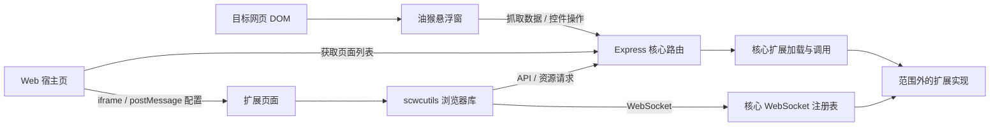

# SCWC 核心项目地图

> 面向后续参与开发的 AI。核对日期：2026-10-07。
> 本文依据当前源码、类型、脚本和配置整理；README 仅作背景参考。源码变化后，应同步更新相关条目。
> 范围不包含 `projects/server/plugins/` 下各插件的实现、模板和私有页面，只说明核心如何加载、调用和承载扩展。`projects/server/plugin/`（单数）属于核心。

## 1. 先建立整体认识

SCWC 是一个由本地 Node 服务、网页中的油猴脚本和 Web 宿主页组成的工作区项目。核心负责选择网页元素、生成抓取数据、传输与鉴权、加载扩展、渲染扩展控件和承载扩展页面。网站专用的数据处理和业务页面由范围外的插件提供。

| 模块 | 运行环境 | 职责 | 首读入口 |
| --- | --- | --- | --- |
| `projects/server` | Node.js / Express | HTTP、WebSocket、扩展生命周期、终端命令、缓存与数据工具 | [index.ts](../projects/server/index.ts)、[router/index.ts](../projects/server/router/index.ts) |
| `projects/user-script` | 目标网页，油猴脚本 / Lit | 悬浮窗、元素选择、抓取列表、扩展控件、脚本设置 | [src/main.ts](../projects/user-script/src/main.ts) |
| `projects/web` | 浏览器 / Lit | 列出可用扩展页面，通过 iframe 打开页面并传入配置 | [src/main.ts](../projects/web/src/main.ts)、[layouts/content.ts](../projects/web/src/layouts/content.ts) |
| `projects/shared` | 浏览器 | 三个浏览器模块复用的控件、配置、存储、类型和工具 | [store/config.ts](../projects/shared/store/config.ts)、[utils/common.ts](../projects/shared/utils/common.ts) |
| `projects/webutils` | 扩展页面中的浏览器脚本 | 提供 `scwcutils.fetch/resource/websocket`，连接页面与核心服务 | [lib/index.ts](../projects/webutils/lib/index.ts)、[lib/utils/fetch.ts](../projects/webutils/lib/utils/fetch.ts) |

主要技术：TypeScript、ESM、Express 5、Lit、Vite、vite-plugin-monkey、Zod、ws；服务端缓存使用 cache-manager、Keyv、内存存储和 Redis。



建议阅读顺序：本地图 → 根 [package.json](../package.json) → 服务端入口和主路由 → 当前任务对应的浏览器入口 → 接口两端的类型与实现。不要把根 README 的功能列表和 TODO 当成已实现行为。

## 2. 目录导航

```text
仓库根目录
├── package.json                 工作区、公共依赖、开发/构建/检查命令
├── tsconfig*.json               分环境的类型检查范围；均不输出服务端 JS
├── vitest.config.ts             测试项目注册
├── oxlint.config.ts             TypeScript 与 import 等规则
├── oxfmt.config.ts              格式化配置
├── docs/map.md                  本地图
└── projects/
    ├── server/
    │   ├── index.ts             服务进程入口与退出生命周期
    │   ├── common/              环境变量、运行模式、系统日志
    │   ├── scripts/             启动终端、Web / SEA 构建
    │   ├── command/             默认命令、stdin / IPC 调用
    │   ├── plugin/              核心扩展加载器和日志（单数）
    │   ├── router/              抓取、油猴控件、Web 页面/API/资源/WebSocket
    │   ├── utils/               缓存、请求、命令解析、写数据、字符串工具
    │   ├── types/               服务端工具的类型声明
    │   └── public/
    │       ├── web/             Web 构建产物
    │       ├── lib/             scwcutils 构建产物
    │       └── resources/       公共静态资源，如字体和图标
    ├── terminal/
    │   ├── index.ts             终端入口与 TTY 恢复
    │   ├── controller.ts        全局命令、确认、取消与重启
    │   ├── model.ts、render.ts  窗口/输入状态与全屏渲染
    │   ├── core.ts、peer.ts     核心子进程及版本化 IPC
    │   ├── storage.ts           原子状态文件、备份、锁
    │   └── plugins/             独立终端命令宿主与禁用模板
    ├── user-script/
    │   ├── vite.config.ts       油猴打包配置
    │   └── src/
    │       ├── main.ts          注册组件、迁移存储、挂载悬浮窗
    │       ├── layouts/         悬浮窗与抓取/控件区域
    │       ├── layouts/hooks/   扩展控件状态管理
    │       ├── api/             抓取请求与控件请求
    │       ├── utils/           DOM 定位、数据抽取、通知导出
    │       └── types/           抓取列表项与响应类型
    ├── web/
    │   ├── index.html           app-root 挂载点
    │   ├── style.css、var.css   页面样式与变量
    │   ├── vite.config.ts       Web 开发与构建配置
    │   └── src/                宿主页布局、页面列表请求与类型
    ├── shared/
    │   ├── components/         scwc-* 自定义控件和通知
    │   ├── store/config.ts     浏览器配置及设置控件
    │   ├── types/              浏览器公共类型
    │   └── utils/              存储、迁移、规则解析等工具
    └── webutils/
        ├── lib/index.ts        scwcutils 初始化与配置接收
        ├── lib/utils/fetch.ts  API、资源 URL、WebSocket 封装
        ├── lib.d.ts            Window.scwcutils 类型扩展
        └── vite.config.ts      浏览器库构建
```

`dist/`、`server/public/web/`、`server/public/lib/` 是生成物。修改对应源码和构建配置，不直接修改生成物。公共图标和字体目录无需逐项阅读。

## 3. 服务端：启动、生命周期与扩展边界

### 3.1 实际启动链

根命令 dev:server / prod:server → [scripts/setup.ts](../projects/server/scripts/setup.ts) → [terminal/index.ts](../projects/terminal/index.ts) → IPC 子进程 [server/index.ts](../projects/server/index.ts)。

1. setup.ts 使用公共参数解析器，保留 mode/build/use-tsx 的原缩写。生产缺少 Web 构建时先构建；只负责构建准备并调用终端，不代理 stdin 或控制重启。
2. 终端持有用户 stdin/stdout，恢复窗口状态后以 --interaction=ipc 启动核心；--use-tsx 可为源码核心使用工作区 tsx。源码运行需要 Node 24+。
3. 核心等待握手，确认插件目录覆盖后注册命令、绑定 HTTP / WebSocket 并后台加载插件。终端接收 ready、命令目录与状态更新。插件加载期间 HTTP 仍可处理请求。
4. 直接启动核心时不启用终端 IPC，使用 readline 按行执行命令。多窗口终端的重启保留自身与窗口，只替换核心及业务插件。详见 [终端使用说明](../projects/terminal/README.md)。

[common/environment.ts](../projects/server/common/environment.ts) 在消费 Redis 和服务配置前初始化环境。源码模式读取仓库根 `.env`，SEA 模式读取可执行文件同目录 `.env`；文件中的键优先，缺省键沿用进程环境。[common/setupParam.ts](../projects/server/common/setupParam.ts) 使用公共解析器处理 `--key=value` 和 `--key value`，决定 `isDev` / `isProd`。setup.ts 与核心共用该解析器；旧 scripts/parseArgs.ts 已不在启动链。

`listen()` 在 `router/index.ts` 内用 `createServer(app)` 建立 HTTP 服务，再挂载 WebSocket upgrade 处理。它返回 Promise，使用 [utils/listen.ts](../projects/server/utils/listen.ts) 直接依次绑定候选端口，只在 EADDRINUSE 时递增，默认最大偏移 20。`PORT_SEARCH_RANGE` / `--port-range` 可调整范围，`--port` 覆盖起始端口。日志和 `server info` 使用最终端口。当前只传入端口进行监听，`HOST` 用于 URL/日志等配置，没有作为监听地址传给 `server.listen()`。

### 3.2 扩展加载器属于核心

[plugin/load.ts](../projects/server/plugin/load.ts) 暴露两个进程内数组：`plugins`（已加载）和 `inactivePlugins`（未激活及原因）。所有抓取路由、控件路由、页面列表和终端命令读取这些数组。

加载器通过 `configuredPluginDirectory()` 选择目录：开发默认仓库 `projects/server/plugins`，生产默认程序同目录 `plugins`，SCWC_PLUGIN_DIR 可覆盖默认值，--plugin-dir 可覆盖环境配置；两者同时提供时先警告并确认：直接核心输入 y，终端输入 :y 加 Enter；其他输入保留环境目录。确认在 HTTP 服务启动前进行。`loadPlugins(directory)` 仍支持显式目录参数。加载器扫描子目录，读取元数据，检查启用状态和 `.ts` / `.js` 入口。`pluginId` 是目录名；`safeId` 是本次加载生成的 UUID，用于页面 API、资源和 WebSocket 路由。

所有启用插件默认由独立 Node 子进程加载，package.json.runtime 与入口 apiVersion 均可省略，默认分别为 process 和 2。入口使用公开 `SCWC.IPluginHandler` 第二版契约；IProcessPluginHandler / TProcess* 保留为同契约别名。核心不导入插件入口，不再支持进程内加载分支。显式填写不支持的模式/版本时记录到 inactivePlugins；enabled: false 保持禁用。runtime 可仅包含超时覆盖。加载器最多同时激活两个插件，成功项立即注册。

核心的 handler 是本地调用代理，函数和实际业务状态留在插件进程。第二版 API 接收可序列化 request；资源返回文件或小响应描述，由核心执行 Range/流式下载；WebSocket 真实连接仍由核心承载。动态 HTML 支持异步调用与最近成功快照。缓存由核心按插件目录名绑定命名空间。createRetryGet 的流式响应在宿主本地消费，不进入 IPC 缓存；普通响应支持缓存及自定义请求类。

运行实现与完整限制见 [独立插件宿主](../projects/server/plugin/process/README.md)。重要入口是 client.ts（进程及代理）、host.ts（插件回调）、rpc.ts（有界通信）、resource.ts（核心资源发送）和 types/plugin-process.d.ts（第二版类型）。当前十个插件入口（含模板和禁用插件）均完成迁移；禁用状态不变。没有单插件热重载或写请求自动重放。

### 3.3 退出与重启

`index.ts` 的退出处理先等待加载流程结束，再逐项等待已加载扩展的 `onUnload(logger, { isRestart })`。普通退出再调用核心缓存的 `clearAll`，重启保留缓存，最后 `process.exit(0)`。单项卸载失败不会跳过其他插件的卸载；独立宿主卸载有截止时间并清理后代进程。

直接核心的 exit / restart 通过进程内部 message 触发退出；直接 restart 只结束当前进程。终端通过 command/ipc.ts 发出生命周期请求，聚合任务并确认后停止，再由 terminal/controller.ts 重新拉起核心。SIGINT / SIGTERM 也进入卸载处理。

`scripts/dev.ts` 和 `router/utils/path.ts` 当前为空。`scripts/proxy.ts` 没有接入启动链；`scripts/restart.ts` 是未接入当前流程的旧脚本，不应作为现行重启入口。

## 4. 油猴脚本：选择、抓取与控件

### 4.1 悬浮窗与 DOM 抓取

| 文件（相对 `projects/user-script/src/`） | 职责 |
| --- | --- |
| [main.ts](../projects/user-script/src/main.ts) | 导入组件、调用存储迁移、建立 `selective-crawl-floating-root`，在 `window.load` 时挂载 `scwc-layout-root`；接收隐藏子页面悬浮窗的消息 |
| [layouts/root.ts](../projects/user-script/src/layouts/root.ts) | 窗口位置、最小化、区域展开状态、活动扩展标签和持久化 |
| `layouts/header.ts`、`layouts/minimized.ts` | 展开窗口拖动与边界限制、最小化贴边入口和纵向拖动 |
| [layouts/content.ts](../projects/user-script/src/layouts/content.ts) | 协调抓取区域和扩展区域，转发列表及标签变化事件 |
| [layouts/content-claw.ts](../projects/user-script/src/layouts/content-claw.ts) | 元素选择、高亮、选择父元素/撤回、列表编辑与排序、抓取动作 |
| [utils/selector.ts](../projects/user-script/src/utils/selector.ts) | `getSelector()` 生成定位表达式，`getElementBySelector()` 重新定位 |
| [utils/claw.ts](../projects/user-script/src/utils/claw.ts) | `getCrawlData()` 在动作发生时从当前 DOM 抽取文字与图片 |
| [api/crawl.ts](../projects/user-script/src/api/crawl.ts) | `sendCrawlRequest()` 提交结果并规范化响应 |

源码中的 `claw` 是现有文件/变量拼写；HTTP 接口和部分函数使用 `crawl` / `scrape`。

抓取流程：

1. `content-claw.ts` 在 document 上监听鼠标移动和捕获阶段点击，排除悬浮窗等元素，使用 `scwc-element-highlight` 显示选中区域。
2. 确认后保存定位表达式、标签和前缀；不会持久化 DOM 对象或抓取结果。
3. 点击抓取时，`getCrawlData(items)` 重新定位每项，用 TreeWalker 遍历文本节点，去掉空白片段，在每段文本前加前缀，再用空格连接。
4. 收集选中元素自身及后代 `img`，通过 canvas 转为 PNG dataURL；转换抛错时退回 `img.src`。
5. 任一定位失败时，普通抓取动作直接中止上传；成功后向 `/api/metadata/scrape` 发送数组并显示响应通知。

两个不同层次的数据：

```ts
// 浏览器持久化的抓取项：projects/user-script/src/types/claw.d.ts
type Item = { selector: string; label: string; prefix: string };

// 上传给服务端的数据项
type DataItem = { label: string; value: string; images: string[] };

// getCrawlData 的返回结果
type CrawlData = { result: DataItem[]; failed: string[] };
```

`failed` 保存未定位到的 selector 字符串。普通抓取请求体是 `{ site: window.location.href, data: result }`；查询参数还要另带 `site` 供鉴权使用。当前抽取只处理 document 中的文字和 `img`，没有通用 HTML、iframe 或 Shadow DOM 遍历器。空标签按原字符串传递，没有在抽取函数中自动替换为 `<null>`。

服务端主路由校验请求体，然后按照 URL 匹配逐个、顺序调用扩展的 `onRequest`。`logger.toWeb()` 收集消息，最终放进 HTTP 响应；它不是实时推送。核心没有默认保存路径，也不会自动调用 `writeData()`。无匹配处理者时返回 `success: false`；有处理者正常完成就可返回成功，其他处理者抛错只记录日志，因此成功响应不表示所有处理者均成功。

### 4.2 油猴扩展控件

[layouts/content-plugin.ts](../projects/user-script/src/layouts/content-plugin.ts) 渲染标签页和控件；[layouts/hooks/plugins.ts](../projects/user-script/src/layouts/hooks/plugins.ts) 中的 `PluginsController` 管理配置请求、活动标签、通道映射、当前值和关联值；[api/plugins.ts](../projects/user-script/src/api/plugins.ts) 执行请求。

- 首次展开扩展区域时，请求 `/api/plugin/config`；列表前面插入本地“设置”标签。设置项通过内部 Symbol 标记并在本地执行，不提交到扩展路由。
- 服务端 [router/plugin.ts](../projects/server/router/plugin.ts) 根据当前 URL 选择扩展，求值静态/动态 `controls`，移除 `trigger`，把通道和关联通道改写为 `plugin:<name>:<pluginId>:<channel>`。
- 前端支持 `button`、`toggle`、`checkbox`、`select`、`input:text`、`input:number`；触发时重新抓取当前列表，连同 `value`、`relatedValues` 和 `site` 提交 `/api/plugin/toggle`。
- 默认选项由 `getFullOptions()` 补全：`requireFullContent: true`、`autoTrigger: false`、空关联通道/选项、默认值 `null`。按钮可直接请求，其他控件需 `autoTrigger` 才发送请求；允许不完整内容时可提交已成功定位的部分。
- 服务端找到对应控件并调用 `trigger`，将关联值的键还原成扩展内部通道名。浏览器目前处理的结果是 `type: 'notification'` 的通知对象。

`PluginsController` 监听 `urlchangeevent` 并重载配置，但当前核心入口没有导入 `url-change-event` 来产生该事件。共享模块虽然实现了 `refreshRule` 配置和解析器，这条重载路径没有用解析结果判断 URL 变化。不要据此假定 SPA 导航刷新及规则过滤已经完整接通。

## 5. 浏览器共享模块：配置、存储、控件

[shared](../projects/shared/README.md) 面向浏览器，有直接访问 `window`、`document` 和 `localStorage` 的模块。服务端可以引用其中的类型，但不能无条件复用这些运行时代码。

### 5.1 配置与持久化

[store/config.ts](../projects/shared/store/config.ts) 定义 `TConfig` 默认值、`ConfigController`、设置控件和 `configContext`。配置结构如下：

```ts
{
  api: { host: 'http://localhost', port: '3200', token: '' },
  plugin: { refreshRule: '//' },
  notify: { placement: 'tr' }
}
```

实际类型位于 [types/config.d.ts](../projects/shared/types/config.d.ts)。API 配置使用嵌套的 `api.port`，不是旧文档里的顶层 `port`。请求时会删掉端口中的非数字字符；`host` 需要带协议。

| localStorage 键 | 存什么 | 主要读写者 |
| --- | --- | --- |
| `__selective_crawl_items__` | `Item[]` 抓取定位、标签和前缀 | `content-claw.ts` |
| `__selective_crawl_config__` | `TConfig` 服务地址、token、规则和通知位置 | `ConfigController`、webutils |
| `scw-persistent-data` | `version`、窗口位置/最小化、扩展区域展开/活动标签 | 油猴 `layouts/root.ts` |

键集中在 [utils/common.ts](../projects/shared/utils/common.ts)。这些是各页面 origin 的 localStorage，不是跨网站共享的油猴 GM 存储；目标网站、开发 Web 端和生产 Web 端不一定共享配置。

[utils/storage.ts](../projects/shared/utils/storage.ts) 的 `loadFromStorage()` 会补齐/修复类型并回写。默认模板中的数组用函数描述默认值和逐项修复；`whichOnSameType: 'a'` 保留已存值，`'b'` 使用模板值。修改格式前应检查这个合并过程，而不仅修改类型。

[utils/updateLocalStorage.ts](../projects/shared/utils/updateLocalStorage.ts) 在油猴入口调用，将旧的 `scw-floating-pos`、`scw-floating-minimized`、`scw-floating-plugin-expanded` 合入带版本的持久化对象。目前格式版本是 `2.0.0-1`，它与软件版本不是同一概念。

`ConfigController.setConfig()` 更新本实例、回写存储并通知宿主；跨上下文的 `storage` 事件才会更新静态配置并分发给控制器。不要假定本页多个控制器在任一本实例设置变化后都会立即同步。

### 5.2 通用控件与工具

- [components/index.ts](../projects/shared/components/index.ts) 注册 `scwc-button/input/trigger/toggle/select/checkbox`。各控件的 `CustomEvent` 载荷和事件映射在对应 `.ts` 文件中；输入和下拉值为字符串，勾选值为布尔值。数字输入也先返回字符串。
- [components/notify.ts](../projects/shared/components/notify.ts) 提供 `notify()`、`scwc-notify` 和 `window.scwc.notify`，管理通知队列、位置、超时与关闭。导入模块时就会创建/复用通知挂载点。
- [utils/customElement.ts](../projects/shared/utils/customElement.ts) 包装 Lit 注册器，避免共享控件重复注册。布局组件多数直接使用 Lit 的注册器，修改时注意差别。
- [utils/refreshRuleParser.ts](../projects/shared/utils/refreshRuleParser.ts) 将 `//`、`?`、`#` 区域及 `\i/\c/\a/\d` 规则解析为 pathname/search/hash 结构，返回 `result`、诊断 `info` 和 `state`；详细语义见 `types/config.d.ts` 及配套测试。它只解析规则，没有比较新旧 URL 的执行器。
- `utils/cache.ts` 是基于参数 JSON 字符串的函数记忆缓存，和服务端 Redis 缓存无关；`utils/debounce.ts`、`tryCatch.ts`、`console.ts`、`fetch.ts` 分别提供防抖、元组式异常处理、日志、FetchError。

## 6. Web 宿主页与 scwcutils

### 6.1 宿主页加载页面

`web/index.html` → `web/src/main.ts` → `layouts/index.ts` → `layouts/root.ts`。宿主页的核心逻辑在 [web/src/layouts/content.ts](../projects/web/src/layouts/content.ts)：

1. 连接组件时通过 [api/plugins.ts](../projects/web/src/api/plugins.ts) 请求 `/web/api/pages`。这里只列出具有 `ui.entry` 的扩展，不按目标网站 URL 过滤。
2. 侧栏使用目录名显示条目，点击后加载 `/web/page/plugin/<dir>` 的 iframe。
3. iframe load 时发送 `scwc-plugin-config`（配置）和 `scwc-plugin-hinder`（是否隐藏油猴窗）消息。

[server/router/web/page/index.ts](../projects/server/router/web/page/index.ts) 解析 `ui.entry`（相对路径以扩展入口文件所在目录为基准），返回 `ui.html()` 或入口 HTML，并在 `</body>` 前注入最新 `scwcutils` 库。它也提供入口目录下的静态资源；未找到且末段不含 `.` 的路径回退到入口 HTML，支持 SPA 深链接。错误页模板是同目录的 `worry.html`。

库文件从 `public/lib/` 读取，按照文件名内的 36 进制时间戳选择最新项；即使请求的是旧时间戳的库 URL，也会返回最新文件。没有匹配库文件时不注入。相关目录应先通过构建生成。

当前宿主页不是通用日志、终端或扩展状态控制台；这些业务功能不能从宿主页布局本身推断出来。

### 6.2 浏览器库初始化和通信

[webutils/lib/index.ts](../projects/webutils/lib/index.ts) 导出浏览器全局库对象，公开类型通过 [lib.d.ts](../projects/webutils/lib.d.ts) 扩展 `Window.scwcutils`。

- 收到 `scwc-plugin-config` 后，根据父页面配置重新初始化；独立打开时，在 `window.load` 中从本 origin 的 localStorage 初始化。
- [createFetch()](../projects/webutils/lib/utils/fetch.ts) 从当前 pathname 第五段读取扩展目录名，先调用 `/web/api/safeId/<dir>`。
- `scwcutils.fetch(path, options)` 发往 `/web/api/plugin/<safeId>/<path>`，自动带 `site`、JSON Content-Type 和 Bearer token，返回解析后的响应对象。
- `scwcutils.resource(path)` 只构造 `/web/resource/plugin/<safeId>/<path>?site=...`，供媒体等元素使用；它不会自动生成资源票据。
- `scwcutils.websocket(path, protocols?)` 根据当前页面选择 `ws:` / `wss:`，在查询参数中传入 `site` 与 token。

这些请求使用页面同源的相对路径；配置中的 host/port 没有用于这组 API URL。页面目录定位依赖 `/web/page/plugin/<dir>` 结构，改变路径要同时修改服务端页面路由和 `createFetch()`。

当前配置不会自动推送至已经打开的 iframe，独立页面也不监听配置变化；消息接收器没有检查 `event.origin` / `event.source`，宿主页使用 `postMessage(..., '*')`。修改 iframe 配置传递或访问边界时，应同时检查宿主页、webutils 和油猴入口。

## 7. 路由与鉴权速查

HTTP 通用中间件位于 [server/router/index.ts](../projects/server/router/index.ts)：

- JSON 请求体上限为 `100mb`。
- CORS 放行任意 origin，声明的方法为 `GET,POST,OPTIONS`，请求头为 `Content-Type, Authorization`；OPTIONS 直接返回 200。
- GET `/web` 和 `/web/*` 跳过通用鉴权，唯独 `/web/api` 与其子路径仍要验证。API 要有 Origin 或 Referer、查询参数 `site`，并通过 `isSameDomain()`。
- [utils/url.ts](../projects/server/utils/url.ts) 的“同域”只比较 URL 的 `hostname`，不比较协议和端口。
- 非空 TOKEN 时，还要求 `Authorization: Bearer <token>`。缺少头为 401，值无效为 403；关闭 token 验证仍要求 API 的来源/site 验证。

| 方法与路径 | 核心实现 | 用途 / 响应约定 |
| --- | --- | --- |
| POST `/api/metadata/scrape` | `router/index.ts` | `{ site, data }`；响应 `{ success, message, data }` |
| GET `/api/plugin/config` | `router/plugin.ts` | 当前网站的油猴控件配置；响应 `{ code, message, data }` |
| POST `/api/plugin/toggle` | `router/plugin.ts` | `{ type, channel, id, context }`；响应 `{ code, message, data }` |
| GET `/web/`、`/web/index.html`、`/web/assets/*` | `router/web/index.ts` | 生产提供构建文件；开发重定向到 `localhost:3201` |
| GET `/web/api/pages` | `router/web/api/index.ts` | 有页面的扩展列表 `{ dir, pluginId }[]`；使用 success 响应 |
| GET `/web/api/safeId/:pluginDir` | 同上 | 获取本次加载的 safeId；使用 success 响应 |
| GET/POST/PUT/DELETE `/web/api/plugin/:safeId/*` | `router/web/api/load.ts` | 注册的页面 API；核心包装 `{ success, message, data }`，处理异常返回 500 |
| GET `/web/resource/plugin/:safeId/*` | 同上 | 注册的资源 handler 自行写响应、验证资源票据；跳过通用 Bearer 验证 |
| GET `/web/page/plugin/:pluginDir` 及子路径 | `router/web/page/index.ts` | HTML、页面资源、SPA 回退与库注入 |
| GET `/web/page/lib/scwcutils.iife.*.js` | 同上 | 最新浏览器库 |
| GET `/web/page/resources/*`、`/web/page/worry/:id` | 同上 | 公共静态资源和 404/500 错误页 |
| upgrade `/web/websocket/plugin/:safeId/*` | `router/web/websocket.ts` | 通道、来源/site、查询 token 独立验证，不经过 Express 中间件 |

两套响应封装 `success` / `code` 同时存在，改接口时必须检查调用端，不要直接统一其中一端。页面 API 虽可注册 PUT/DELETE，当前 CORS 声明没有这两个方法，跨域调用还需核对预检行为。

[PluginWebSocketRegistry](../projects/server/router/web/websocket.ts) 按 `<safeId>/<path>` 隔离通道及客户端集合，支持 `onConnect`、`onMessage`、`onClose`、发送、广播和连接清理函数。文本消息为字符串，二进制为 Buffer；连接初始化失败会关闭连接。`safeId` 是路由标识，不代替访问凭证，服务重启后需要重新获取。

[router/utils/index.ts](../projects/server/router/utils/index.ts) 的 `matchLink()` 是抓取和油猴配置的共用匹配器：普通项做前缀匹配，支持 `*` 与 `!`，空数组会匹配全部；它不是一个直接接受 RegExp 的接口。通配项按代码顺序返回匹配结果，修改否定项优先级时应验证混合规则。

## 8. 服务端公共工具与终端命令

| 工具 | 当前职责和关键约束 |
| --- | --- |
| [utils/cache.ts](../projects/server/utils/cache.ts) | 内存 + Redis 存储，缓存普通值、重定向和文件引用。流和超过 5 MiB 的值写到源码仓库根或可执行文件同目录的 `cache/files`。Redis 支持密码、ACL、IPv6 和 REDIS_KEY_PREFIX，清理限定到当前前缀；缓存管理器配置 TTL 1 小时；内存适配器另有 60 秒 TTL / 5000 项 LRU 配置 |
| `createNamespacedCache(namespace, logger)` | 返回冻结的 `set/setRedirect/get/del/mdel` 对象，命名空间由核心绑定；不暴露全局清理。底层 `clearAll` 属于核心操作，传入 namespace 也会回退为全局清理，不能用于隔离清理单扩展 |
| [utils/axios.ts](../projects/server/utils/axios.ts) | `createRetryGet()` 提供请求、缓存、重定向链和自定义请求类；默认 10 秒超时、最多 5 次尝试、重试间隔 2 秒，针对无响应或 5xx 的 Axios 错误重试；返回 `{ raw, data, delCache }`。`LimitPromise` 提供任务队列与并发限制 |
| [utils/writeData.ts](../projects/server/utils/writeData.ts) | `writeData(dir, data)` 创建目录，将数据追加到 `data.json` 根数组；抓取数组的图片写进 `images/` 并替换为文件路径。`writeDataURL` 支持 dataURL 或 HTTP 图片地址，返回路径或 `false`；单独调用时需保证目标目录存在 |
| [utils/fetchImage.ts](../projects/server/utils/fetchImage.ts) | 原生 fetch 图片并返回 Buffer 或 `null`，与 Axios 重试工具是不同路径 |
| `utils/strValidation.ts`、`convertToCN.ts` | 替换文件名常见非法字符；通过 OpenCC 做中文/日文汉字转换 |
| [utils/log.ts](../projects/server/utils/log.ts)、`common/logger.ts`、`plugin/log.ts` | 直接核心使用彩色控制台日志；IPC 模式按固定窗口/执行 ID 发送结构化输出，终端在状态文件中保存输出历史 |
| [utils/tryCatch.ts](../projects/server/utils/tryCatch.ts) | 同步/异步函数包装为 `[error, result]`，另提供指定错误类的包装 |

修改缓存、重试和并发工具时，需检查实际异常及异步链路，不能只按函数注释推断所有边界已被处理；`types/` 下声明对应公共工具接口。

[command/index.ts](../projects/server/command/index.ts) 注册 `help`、`exit`、`restart`、`server info`、`plugin ls`、`plugin ps`，；直接模式监听 stdin，终端模式由 command/ipc.ts 调用。[utils/command.ts](../projects/server/utils/command.ts) 负责命令注册、引号分词、选项解析、主/子命令执行和帮助。系统命令先占用名称；扩展命令重名时使用目录 ID 前缀。它处理的是服务终端输入，不是 Web 命令接口。

## 9. 开发、构建与检查

以下命令均从仓库根目录执行。依赖统一放在根 `package.json`，工作区是 `projects/*`；推荐 Bun 管理依赖，Node 运行服务。核心默认插件、配置和缓存路径通过 common/paths.ts 定位，不依赖启动 cwd；CLI 相对目录仍以启动 cwd 为基准。

| 命令 | 用途 |
| --- | --- |
| `bun install` | 安装工作区依赖 |
| `bun run dev:server` | 构建准备后启动开发模式多窗口终端 |
| `bun run dev:web` | 单独启动 Web 的 Vite 开发服务，配置端口 3201 |
| `bun run dev:us` | 启动油猴脚本的 Vite/monkey 开发服务 |
| `bun run build` | `tsc -b` 类型检查，然后依次构建 user-script、web、webutils |
| `bun run build:core` | Node >= 25.5 构建本机 SEA 可执行文件至 dist/core；包含核心、终端、两类宿主和静态资源 |
| `bun run test:core-executable` | 构建后验证独立部署，需本机 redis-server；使用独立临时数据、密码与端口 |
| `bun run prod:server` | 构建准备后启动生产模式多窗口终端 |
| `bun run test --run` | 根配置注册的测试项目，运行一次而非 watch |
| `bun run lint` | Oxlint 检查 |
| `bun run fmt` | Oxfmt 格式化；它会修改文件，不是只读检查 |

开发服务器不会代替你启动两个 Vite 服务。`setup.ts` 虽接受 `--web-host` / `--web-port`，当前没有使用它们转发请求；实际开发 Web 重定向地址在 `router/web/index.ts` 写死为 `http://localhost:3201`。

### 9.1 构建产物与环境配置

| 构建配置 | 产物 | 使用方 |
| --- | --- | --- |
| `user-script/vite.config.ts` | 根 `dist/` 下的油猴脚本 | 油猴管理器安装/开发 |
| `web/vite.config.ts` | `projects/server/public/web/`，生产 base 为 `/web/` | 服务端 Web 路由 |
| `webutils/vite.config.ts` | `projects/server/public/lib/scwcutils.iife.<36进制时间戳>.js` | 核心页面路由注入 |

以上配置均设置 `emptyOutDir: true`。服务端源码直接执行 TypeScript；根 build 没有打包服务端，也没有构建各插件的私有页面。新增独立 build:core 通过 esbuild / Node SEA 打包核心和宿主，并构建、内置 Web / webutils / 公共资源 / 错误模板，不包含业务插件。

服务端 `.env` 变量：`PORT`（默认 3200）、`PORT_SEARCH_RANGE`（默认最大偏移 20）、`HOST`（默认 `http://localhost`）、`TOKEN`、`SCWC_PLUGIN_DIR`，以及 `REDIS_HOST`、`REDIS_PORT`、`REDIS_USER`、`REDIS_PASSWORD`、`REDIS_TIMEOUT`、`REDIS_KEY_PREFIX`。完整配置及目录规则见 [核心部署](核心部署.md) 与 [模板](core.env.example)。

未提供非空 `TOKEN` 时，服务端会生成随机 UUID 并打印；只有字面字符串 `TOKEN=null` 会将 token 设为空。不要通过留空误以为关闭了鉴权。浏览器默认 token 是空，需要通过脚本设置配置。

三个 Vite 配置都调用 `loadEnv(mode, process.cwd())` 再尝试注入 `env.HOST` / `env.PORT`，但没有改变 Vite 默认的 `VITE_` 前缀过滤。因此不能认为根 `.env` 中的普通 HOST/PORT 已自动进入浏览器构建；浏览器最终地址还受默认值和 localStorage 配置控制。修改此处时同时检查工作目录、变量前缀与产物。

缓存模块先导入 common/environment.ts，再用公共校验器读取 Redis 配置；密码通过 RedisClientOptions 传递，Keyv 禁用重复前缀。改变缓存初始化时保持这个环境加载顺序。

### 9.2 TypeScript 检查边界

根 [tsconfig.json](../tsconfig.json) 引用五份配置：

| 配置 | 主要覆盖范围 |
| --- | --- |
| `tsconfig.app.json` | 油猴 src、Web src、shared、Vite 声明，以及 SCWC 全局类型声明 |
| `tsconfig.serve.json` | 服务端 TS，排除扩展私有 Web 目录 |
| `tsconfig.terminal.json` | 多窗口终端、终端插件及公共调用类型 |
| `tsconfig.node.json` | 根目录的 `*.config.ts` |
| `tsconfig.plugin-web.json` | 浏览器库全局声明与扩展私有 Web 类型检查 |

核心仍依赖 `projects/server/plugins/plugin-env.d.ts` 中的全局 `SCWC` 契约。该文件的类型依赖不等于需要阅读或修改各插件；变更核心对外数据、控件、生命周期或页面通道接口时，应同步核对这份契约及两端实现。

这些配置都是 `noEmit`。子项目 `vite.config.ts`、webutils 实现的检查覆盖不能仅由根 `tsc -b` 成功推定，应检查 include/import 链和对应构建。服务端本地 import 保留 `.ts` 后缀，遵循当前 ESM/直接运行 TS 的方式。

### 9.3 当前核心测试

| 测试文件 | 验证内容 |
| --- | --- |
| [server/utils/cache.test.ts](../projects/server/utils/cache.test.ts) | 绑定命名空间后的同名键隔离、重定向/删除边界、对象不暴露全局操作；底层缓存被 mock，不验证真实 Redis |
| [server/router/web/websocket.test.ts](../projects/server/router/web/websocket.test.ts) | 不同 safeId 下相同通道隔离及消息分发；缺少 site 的握手被拒绝，未单独覆盖带有效 site 的错误 token 情形 |
| [server/common/config.test.ts](../projects/server/common/config.test.ts) | 端口范围和 CLI 解析、Redis 密码/ACL/IPv6/前缀、插件目录优先级与确认分支 |
| [server/common/environment.test.ts](../projects/server/common/environment.test.ts) | `.env` 优先、未配置键与缺失文件回退 |
| [server/utils/listen.test.ts](../projects/server/utils/listen.test.ts) | 真实端口占用后的绑定、范围耗尽、权限错误不重试 |
| `server/plugin/process/*.test.ts` | 默认独立宿主、RPC 边界、插件激活/超时/崩溃/卸载、请求与资源及进程树清理；installed-plugins 测试涉及本机安装的插件 |
| [shared/utils/refreshRuleParser.test.ts](../projects/shared/utils/refreshRuleParser.test.ts) | pathname、search、hash 和组合规则解析 |

根 Vitest 注册 server、user-script、web、terminal；会收集服务端公共工具、配置和进程宿主测试，没有收集 shared 的规则测试。installed-plugins 等测试依赖本机安装插件，针对核心可显式指定文件。端口与 WebSocket 测试需要允许本机监听端口。针对核心的命令：

```bash
# 只运行这两个核心服务端测试，避免带入范围外的扩展测试
bun run test --run projects/server/utils/cache.test.ts projects/server/router/web/websocket.test.ts

# 使用独立配置从仓库根收集 shared 测试
bunx vitest run --config projects/server/vitest.config.ts projects/shared/utils/refreshRuleParser.test.ts
```

选择/抓取 UI、普通 HTTP 鉴权、页面 API 和 iframe 配置流程目前没有专门的核心自动化测试文件。修改相应功能时结合目标场景验证；文档核对和测试发现不代表这些运行流程已通过测试。

## 10. 接到开发任务后从哪里开始

| 任务 | 优先检查的核心位置 | 需要联动核对 |
| --- | --- | --- |
| 选择元素、抓取文字/图片、列表编辑 | `user-script/src/layouts/content-claw.ts`、`utils/selector.ts`、`utils/claw.ts` | `Item`、抓取失败策略、持久化格式、`api/crawl.ts` |
| 窗口位置、展开与最小化 | 油猴 `layouts/root.ts`、`header.ts`、`minimized.ts` 及对应 CSS | `scw-persistent-data`、迁移逻辑 |
| 油猴控件加载、触发、关联值 | 油猴 `layouts/hooks/plugins.ts`、`content-plugin.ts`、`api/plugins.ts` | 服务端 `router/plugin.ts`、共享控件与公共契约 |
| API 数据格式或上传行为 | `server/router/index.ts`、油猴 `api/crawl.ts` | Zod schema、响应类型、消息展示、公共契约 |
| 服务地址、token、来源验证 | `server/common/env.ts`、`router/index.ts`、`utils/url.ts` | `shared/store/config.ts`、各请求封装、WebSocket 独立验证 |
| 生命周期、启动/重启、命令 | `server/index.ts`、`scripts/setup.ts`、`plugin/load.ts`、`command/index.ts` | 父子进程职责、onUnload、缓存清理、`utils/command.ts` |
| Web 页面列表、iframe、配置传递 | `web/src/layouts/content.ts`、`api/plugins.ts` | 服务端页面路由、webutils 初始化、油猴消息接收 |
| 页面 API、资源、WebSocket | `server/router/web/api/load.ts`、`web/websocket.ts` | `plugin/load.ts` 的注册、webutils 封装与类型、通道鉴权 |
| 缓存、重试、并发、数据保存 | `server/utils/cache.ts`、`axios.ts`、`writeData.ts` | 对应工具类型、onLoad 注入、命名空间及异常路径 |
| 共享控件、通知、配置或存储格式 | `shared/components/`、`store/config.ts`、`utils/storage.ts` | 所有浏览器使用方、迁移和事件载荷 |
| 构建产物、开发端口、环境注入 | 根 `package.json`、三个 Vite 配置、`server/scripts/build.ts` | 服务端静态路由、tsconfig 范围、生成目录 |

开发前先读对应行涉及的调用端与处理端，再确认当前工作区变更。修改公共接口时同时更新运行时校验、类型和调用方；不要把生成目录、旧脚本、未接通的 TODO 或其他插件的内部实现当作核心依据。

### 2026-10-06 插件进程隔离第一阶段

已建立独立 Node 宿主和第二版可序列化契约，现以第二版为默认并完成全部插件入口迁移。隔离测试在临时目录启动真实贴纸插件；验证同步阻塞时核心及另一个插件可响应、媒体 Range/下载及 WebSocket 可用，以及启动失败、超时、崩溃、卸载和后代清理。类型检查与原生 Node 导入验证通过。贴纸内部读写分离和统一重任务预算属于后续阶段。

### 2026-10-06 默认第二版契约与全插件迁移

所有启用插件默认采用独立进程；省略 runtime/apiVersion 或只设置超时都不会进入核心执行。公开 IPluginHandler、TPluginApi、TPluginResource、TPluginRequestContext 和 WebSocket 类型统一为可序列化契约；内部 Express/socket 类型使用 Hosted 名称。ASMR 媒体资源迁移到文件描述，图片插件等待下载与保存完成；注入 retryGet 的 Readable 留在子进程消费。测试逐个激活和卸载十个插件并覆盖默认配置、禁用状态、ASMR 登录/票据、缓存与流式请求，数据均使用临时目录。

### 2026-10-07 核心配置、端口与独立部署

新增 common/paths.ts、environment.ts、config.ts、pluginDirectory.ts，统一源码/SEA 目录及环境优先级、端口/Redis 校验和插件目录确认。scripts/build-executable.ts 构建本机可执行文件，sea-bootstrap.ts 将内置资源释放到私有临时目录，再加载核心或插件宿主。客户端 fork 在 SEA 中通过 --scwc-plugin-host 分支复用同一可执行文件，保持高级 IPC 序列化及外部插件动态导入。

新增 config/environment/listen 测试及独立部署 smoke 脚本。已按确认的 [设计方案](终端设计方案.md) 实现多窗口终端、固定 UUID / logger 归属、主动/自动任务状态、全屏输入/鼠标、确认/取消/重启、原子持久化及独立终端插件。setup.ts 只做构建准备和终端启动。入口与配置见 terminal/README.md；目前本机验证为 macOS，Windows/Linux 需要对应终端人工验收。


### 2026-10-07 多窗口终端与调用任务

核心 common/tasks.ts 提供 TaskRegistry / TaskScope、AsyncLocalStorage 和调用上下文。主/子命令第五参数注入 tasks / signal；onLoad 注入进程级 reporter，宿主每次业务调用另建作用域。函数返回不清除主动 busy 或 begin 句柄，窗口使用 command.returned / command.finished 区分后台阶段。插件宿主停止会中断相关调用，旧 reporter 消息不影响新宿主。

terminal/peer.ts 的版本 1 负责终端↔核心；现有插件 RPC 仍为版本 2，传递身份数据并在宿主生成函数。命令日志绑定固定 windowId / executionId；非命令 HTTP 请求也统计自动任务，取消时关闭活动响应。终端命令插件的 invokeCore 保持父任务忙状态直到子执行整体结束。

终端状态用版本 1 JSON 保存，默认 data/terminal/state.json，支持 SCWC_TERMINAL_STATE_FILE / SCWC_TERMINAL_PERSIST / SCWC_CMD_PLUGIN_DIR。每秒原子保存脏快照并保留备份；强杀只恢复最近快照，不重放任务。默认双窗、最多 128 窗、每窗 10,000 行或 10 MiB。独立 SEA 支持 --terminal，并内置 terminal.cjs / terminal-host.cjs。
